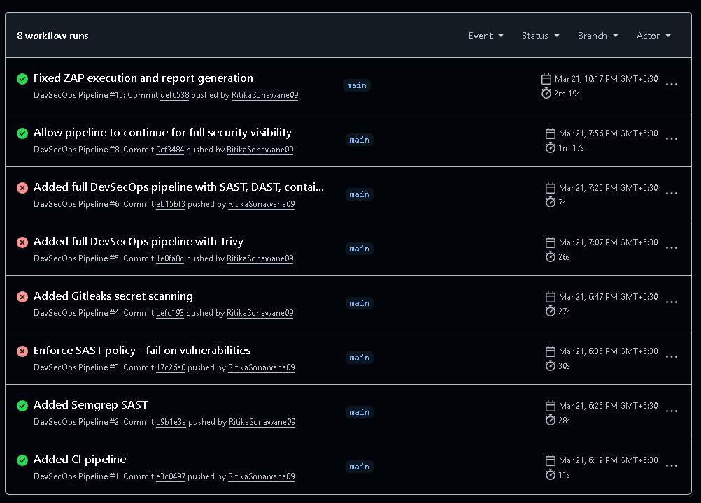
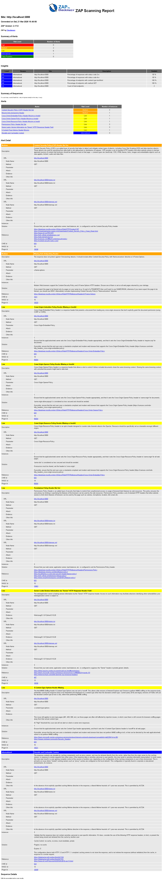

#  DevSecOps Secure CI/CD Pipeline

##  Overview
This project demonstrates a production-style DevSecOps pipeline integrating security across the software development lifecycle.

The pipeline automatically scans for:
- Code vulnerabilities (SAST)
- Secrets exposure
- Container vulnerabilities
- Runtime security issues (DAST)

---

##  Tech Stack
- Python (Flask)
- Docker
- GitHub Actions

---

## Security Tools Used

| Tool | Purpose |
|------|--------|
| Semgrep | Static Application Security Testing (SAST) |
| Gitleaks | Secrets detection |
| Trivy | Container vulnerability scanning |
| OWASP ZAP | Dynamic Application Security Testing (DAST) |

---

## Pipeline Flow

1. Code checkout
2. Dependency installation
3. SAST scan (Semgrep)
4. Secrets scan (Gitleaks)
5. Build Docker image
6. Container scan (Trivy)
7. Run application
8. DAST scan (OWASP ZAP)
9. Upload security report

---

## Sample ZAP Findings

The DAST scan identified:
- Missing Content Security Policy (CSP)
- Missing X-Frame-Options (Clickjacking protection)
- Missing security headers

These findings highlight common misconfigurations in early-stage applications.

---

##  Key Features

- Shift-left security approach
- Automated security gates in CI/CD
- Multi-layer security scanning
- Realistic vulnerability detection
- Fast feedback loops for developers

---

##  Pipeline Execution

- GitHub Actions pipeline

- ZAP report

- Failing security checks
[Failing Security Checks](Images/Failing Security Checks.png)
---

##  Note
This project intentionally includes minor vulnerabilities to demonstrate detection capabilities.

---

## Future Improvements
- Integrate SCA (dependency scanning)
- Add policy-based enforcement
- Implement auto-remediation suggestions
- Integrate SIEM for alerting

---

##  Author
Ritika Sonawane